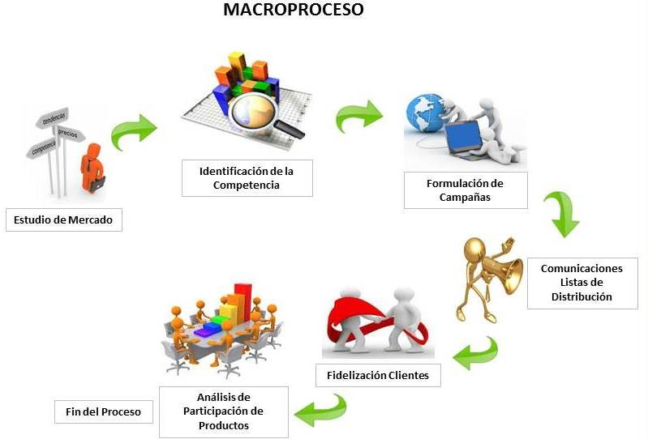

# Mercadeo

Su objetivo es mantener la información referente al mercado y que es importante para la definición de las políticas comerciales de la empresa y para el logro de sus objetivos.  

* Permite la inclusión de clientes potenciales de la empresa, de acuerdo a las líneas de comercialización que se tengan y medir la efectividad o resultado de su seguimiento.  

* Facilita la identificación de posibles nuevos productos o modificaciones que requiera el mercado, de acuerdo a las sugerencias e investigaciones realizadas.  

* Mantiene la información relacionada con la publicidad que efectúa la empresa, en los diferentes medios y sus duraciones, para permitir el análisis de su efectividad.  

* Registra las empresas que son competencia, con sus correspondientes productos, precios, campañas de publicidad y plaza que atienden, con el objetivo de determinar la posición de la empresa frente a esta.  

### Datos básicos

Permite definir una serie de datos básicos necesario para la operación del módulo de mercadeo. Estos hacen referencia a la definición de los medios de comunicación, las agencias de publicidad, los canales de comercialización, etc.  

### Fidelización

Esta aplicación permite implementar el programa de fidelización de clientes de la empresa. Empieza con la captura de los datos básicos del cliente (documento, nombre, dirección, actividad, fecha de nacimiento, sexo, etc) para poder hacer promociones o contactos posteriores. .Se le entrega un carné preimpreso o impreso por el sistema. Por cada compra que hace el cliente se le acumulan puntos y son redimidos por medio de descuentos, obsequios o cambiados como forma de pago. Se puede consultar es todo momento el estado de cuenta de los puntos totales y disponibles en cualquier punto de venta.  

Este módulo está encaminado a registrar los posibles nuevos mercados en los cuales se puede involucrar  la empresa. Esta definición se hace a partir de una variedad de fuentes, tales como las sugerencias de los clientes, los requerimientos del mercado, las licitaciones, etc.  

### Competencia

Este módulo está orientado a registrar la información que requiere la empresa para poder medir su influencia en el mercado. Esto se hace identificando quién es la competencia, que productos venden, a que precios, etc.  

De la misma forma permite registrar algunos parámetros relacionados, tales como la publicidad que utilizan, el mercado que cubren y sus posibles fortalezas y debilidades.  

### Campañas

Este módulo se dedica al registro de las diferentes campañas de publicidad que tiene la empresa. Si se tienen datos para la retroalimentación es posible medir el grado de eficacia de estas campañas.  

Como dato contable permite controlar el presupuesto de gasto asignado a publicidad y el control de la ejecución de este.  

### Mercadeo

Este módulo permite registrar información estadística que se obtiene de las diferentes investigaciones de mercado. Permite mantener una gran base de datos para observar tendencias y comportamientos del mercado en las diferentes variables y medidas que tengan que ver con los objetivos comerciales de la empresa.  

### Reportes

Permite elaborar una serie de reportes estándar sobre la operación del módulo de mercadeo. Algunos de estos son el resumen de Campañas publicitarias, el indicador de eficiencia, la ejecución presupuestal de gastos de publicidad, la posición de la empresa con respecto a la competencia, etc.  

