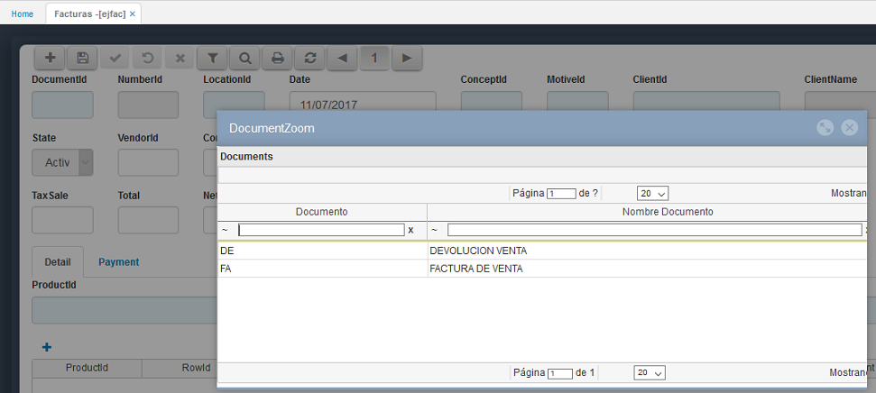
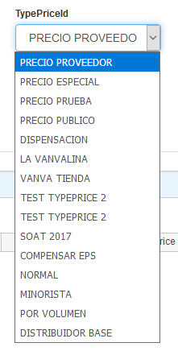
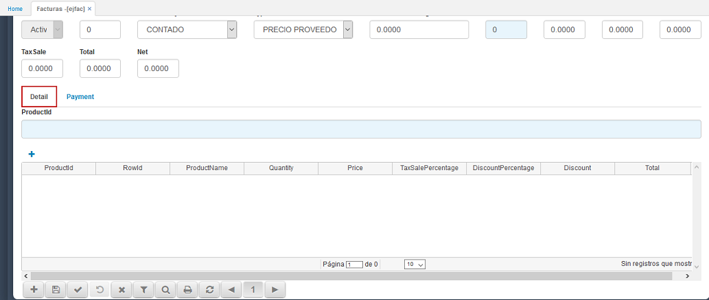
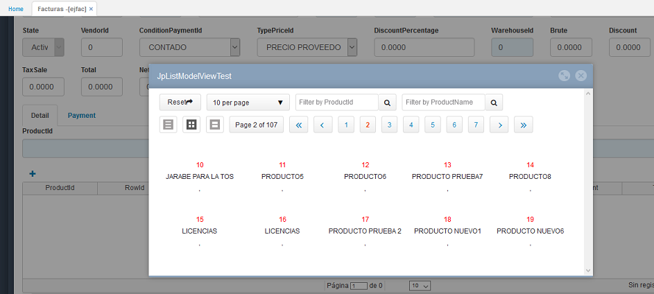
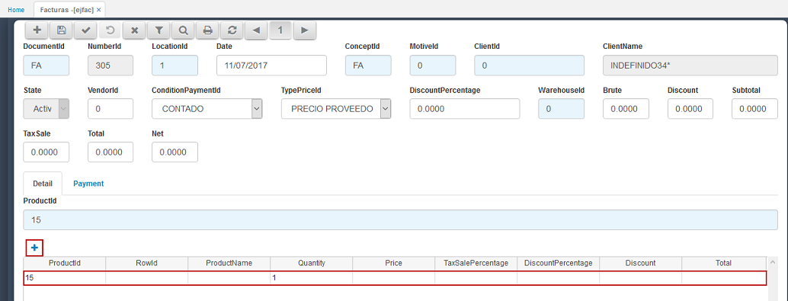
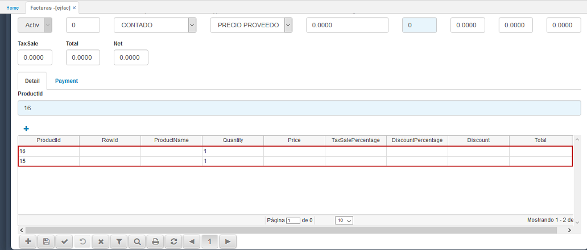
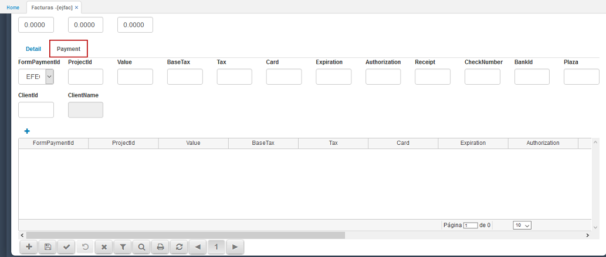
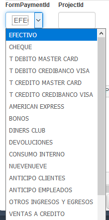
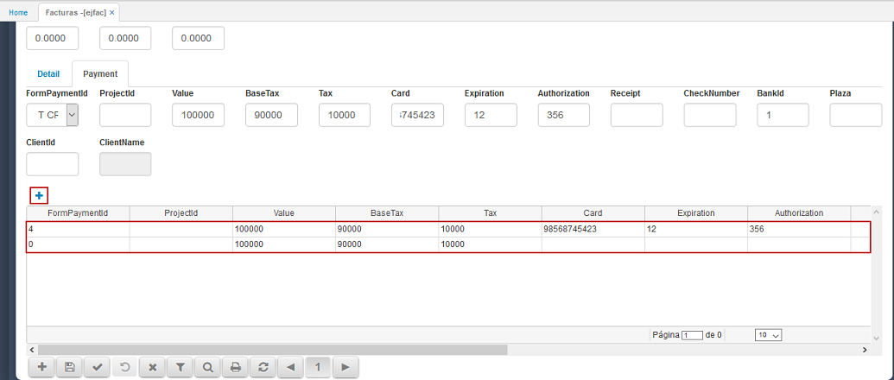

# EJFAC - Facturas

La aplicación **EJFAC** es la versión Post-Touch para facturación, adaptable para tablets y dispositivos móviles, cumpliendo con la misma función de la versión web.  

Los campos que sean de fondo azul indican que tienen zoom, en el cual pueden consultar datos relacionados con el nombre del campo, para acceder se hace doble click sobre el mismo.  

**DocumentId:** Documento parametrizado con anterioridad en la aplicación [**BDOC - Documentos**](http://docs.oasiscom.com/Operacion/common/bsistema/bdoc). Este documento puede ser FA (Factura) o DE (Devolución). Este campo consta con un zoom, en el cual al dar doble click se pueden consultar los documentos disponibles.  

**NumberId:** Consecutivo de documento automático.  
**LocationId:** Ubicación de punto de venta.  
**Date:** Fecha de registro de la factura.  
**ConceptId:** Iniciales del concepto por el cual se desea realizar el documento. Los conceptos se deben parametrizar previamente en la aplicación [**BCON - Conceptos**](http://docs.oasiscom.com/Operacion/common/bsistema/bcon), en este caso el concepto puede ser FA (Factura) o DE (Devolución).  
**MotiveId:** Este se encuentra definido como 0.  
**ClientId:** Número de identificación del cliente al cual se le realiza el documento.  
**ClientName:** El nombre del cliente el sistema lo arroja automáticamente después de diligenciar el número de identificación.  
**State:** El estado es asignado por el sistema, al crear una nueva factura el estado será _Activo_, al confirmarla pasará a _Procesado_ o si la factura es anulada su estado será _Anulado_.  
**VendorId:** Número de identificación de la persona que se encuentra facturando.  
**ConditionPaymentId:** Representa un acuerdo establecido con clientes y proveedores en forma de tipos de descuento y plazos de pago, las diferentes opciones de condición de pago se encuentran parametrizadas en la aplicación [**BCND - Condiciones de Pago**](http://docs.oasiscom.com/Operacion/common/bcomer/bcnd).  

**TypePriceId:** seleccionar el tipo de precio que se asignará a la factura. Los tipos de precio deben estar previamente parametrizados en la aplicación [**FBTP - Tipo de Precio**](http://docs.oasiscom.com/Operacion/scm/facturacion/fbasica/fbtp).

**DiscountPercentage:** Si se desea que el total de la factura tenga un porcentaje de descuento se debe ingresar en este campo el número y este hará el descuento en el valor total de la factura.  
**WarehouseId:** ingresar el Id del almacén que realiza el documento.  
**Brute:** valor bruto del total del documento que se realiza.  
**Discount:** valor del descuento.  
**Subtotal:** valor subtotal del documento.  
**TaxSale:** ingresar el valor por impuesto a las ventas.  
**Total:** ingresar el valor total del documento.  

Ingresados los anteriores datos, damos click en el botón _Guardar_  el cual asignará un número a la factura. 

##### Detalle

En la parte derecha de la ventana se encuentra la pestaña _Detalle_, en donde se seleccionará el producto correspondiente al documento que se realiza, ya sea que se factura o se realiza devolución.  

**ProductId:** ingresar el código del producto o seleccionarlo desde el zoom, para ingresar dar doble click sobre el campo, seleccionar el producto y cerrar la ventana del zoom.  

Seleccionado el producto, se debe dar click en el botón  para que este sea adjuntado a la lista de productos.  

Si se desean agregar más productos, se vuelve a buscar en el campo _ProductId_ y se da click en el botón .

Para eliminar algún producto de la lista se debe dar click sobre el mismo.  

##### Pago

Seguidamente se encuentra la pestaña _Pago (Payment)_, la cual permite realizar la modificación de la forma de pago de la factura, en el campo forma de pago se debe modificar la misma, puede ser efectivo, débito, crédito entre otros, esto se parametriza previamente en el sistema en la aplicación [**BFOR - Formas de Pago**](http://docs.oasiscom.com/Operacion/common/bcomer/bfor).  

**FormPaymentId:** seleccionar de la lista desplegable la forma de pago. Parametrización de formas de pago en la aplicación [**BFOR - Formas de Pago**](http://docs.oasiscom.com/Operacion/common/bcomer/bfor).

**ProjectId:**
**Value:** ingresar el valor total del documento.
**BaseTax:** valor base sobre el cual se aplica el impuesto.  
**Tax:** valor del impuesto
**Card:** en caso de pagar con tarjeta ingresar el número.  
**Expiration:** fecha de expiración de la tarjeta.  
**Authorization:** número de autorización.  
**Receipt:**
**CheckNumber:**
**BankId:**
**Plaza:**

Si el desembolso se va a realizar por diferentes formas de pago, la aplicación permite adicionarlas, igualmente se verán reflejadas en la lista inferior de la ventana.  

Por ejemplo, si una parte del documento se pagará en efectivo, se deberá seleccionar esta forma de pago de la lista desplegable y adicionarla a la lista inferior de la ventana dando click en el botón , así mismo se deberá hacer con las otras formas de pago que se deseen agregar.  

