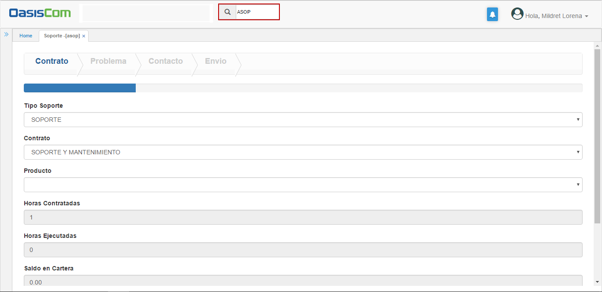
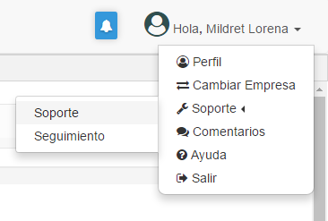
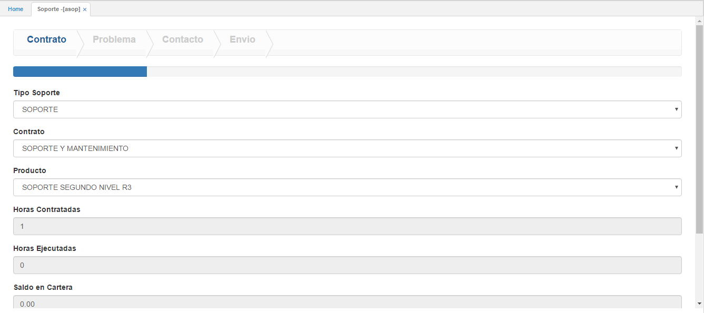
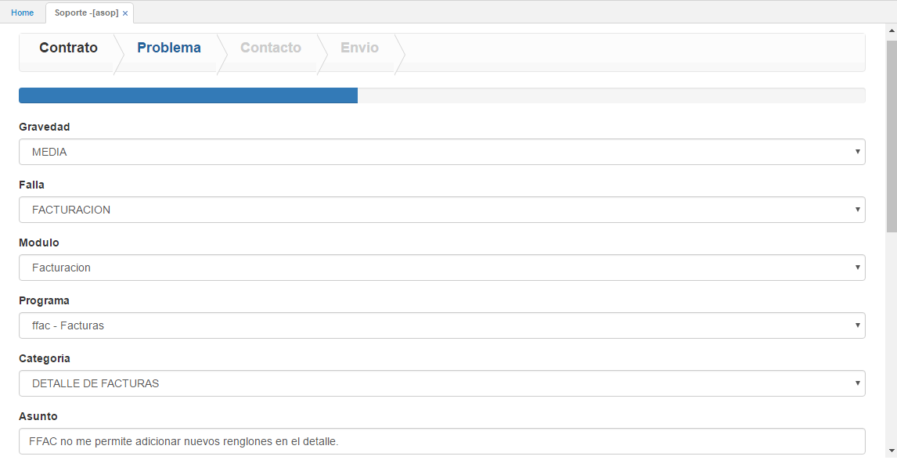
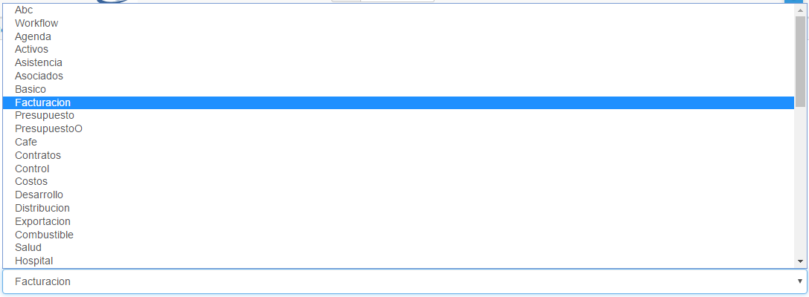
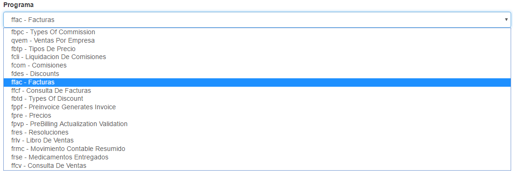
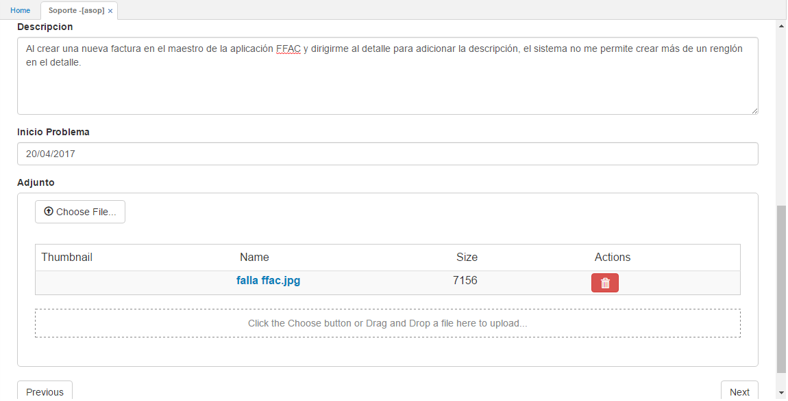
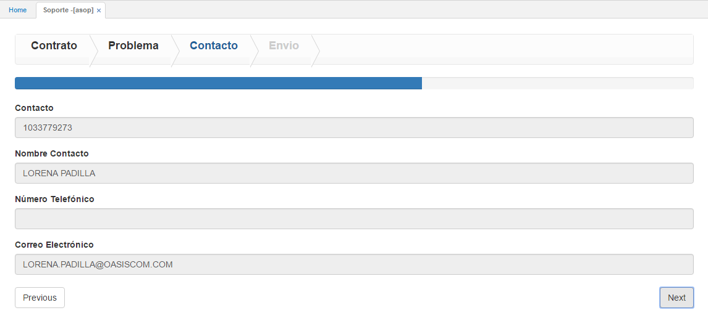

## Soporte - ASOP

Para cargar casos de soporte en el sistema OasisCom ingresaremos a la aplicación **ASOP - Soporte**. Para ingresar a esta aplicación hay dos opciones:  

 * Consultando en el buscador del sistema por el nemótecnico de la aplicación, es decir, ASOP.  

* Dando click en el nombre del usuario, ubicado en la parte superior derecha de la pantalla, se desplegará una ventana con diferentes opciones, allí seleccionaremos la pestaña de _Soporte_ y seguidamente la opción _Soporte_.  

Ubicados en la aplicación ASOP - Soporte, se observarán cuatro pestañas (Contrato, Problema, Contacto, Envío), correspondientes al proceso para el envío del caso de soporte, estas pestañas se deberán diligenciar consecutivamente.  

#### Contrato

En esta pestaña se ingresan los datos correspondientes al contrato de soporte que tiene el cliente con OasisCom, igualmente, muestra las horas contratadas de soporte según el contrato, las horas ejecutadas a la fecha, el saldo que se encuentra en cartera y el saldo en mora, de haberlo.  

**Tipo de soporte:** seleccionar el tipo de soporte contratado con OasisCom.  
**Contrato:** seleccionar el contrato de _Soporte y Mantenimiento_.  
**Producto:** seleccionar el tipo de soporte o producto que se acordó en el contrato.   

Seguidamente, se encuentran campos de información que no son editables pero se deben tener en cuenta para el cargue de casos de soporte.  

Diligenciado el formulario damos click en el botón _Next_, el cual nos trasladará a la siguiente pestaña **Problema**.  

#### Problema

En esta pestaña se ingresa la información que describe el problema por el cual se requiere cargar el caso de soporte.  

**Gravedad:** seleccionar de la lista desplegable la gravedad del problema que se va a reportar. 

**Falla:** seleccionar de la lista desplegable el tipo de falla que está presentando el sistema y por el cual se requiere cargar un caso de soporte.  

**Módulo:** seleccionar el módulo en el cual se está presentando el problema.

**Programa:** seleccionar de la lista el programa del módulo en donde se presenta el problema a reportar.  

**Categoría:** seleccionar la categoría con la cual se puede relacionar la falla que se va a reportar.  

**Asunto:** escribir puntualmente el problema que se desea reportar.  

Deslizamos la ventana y diligenciamos la parte inferior del formato.

**Descripción:** realizar una descripción detallada del caso de soporte que se va a reportar.  
**Inicio problema:** seleccionar la fecha desde la cual ha presenciado el problema.  
**Adjunto:** el sistema permite adjuntar imágenes o capturas de pantalla del problema que se está presentando con el fin de hacer más explícita la descripción del mismo.  

Para adjuntar un archivo, damos click en el botón  y seleccionamos de la ventana emergente la imagen correspondiente a la falla a reportar. Este proceso se puede repetir para cargar varias imágenes.  

Cargadas las imágenes damos click en el botón _Next_ para continuar a la siguiente pestaña de la aplicación.  

#### Contacto

En la pestaña contacto, se podrá observar los datos de la persona a la cual le llegarán los correos electrónicos de seguimiento del caso. Dicha persona es definida por el cliente.  

Verificados los datos damos click en el botón _Next_ para pasar a la siguiente pestaña **Envío**.  

#### Envío

En la pestaña envío, se podrán ver links de manuales y/o videos relacionados con la falla que se está reportando con el fin de que el cliente revise esta documentación y le pueda servir de ayuda para solucionar el problema que le está genenrando el sistema. Si dicha documentación no logra solucionar la falla, se procede a enviar el caso de soporte a OasisCom.  

Para envíar el caso de soporte es necesario leer y aceptar los términos y condiciones del servicio de soporte, estos se pueden ver dando click en el link  y se aceptan activando el flag .  

Finalmente, damos click en el botón  y el caso será creado, el sistema arrojará el número asignado al caso con el cual se podrá realizar seguimiento en la aplicación [**ASEG - Monitoring Cases**](http://docs.oasiscom.com/Operacion/System/sacceso/aseg).

