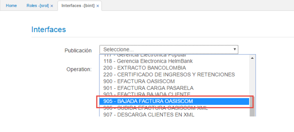
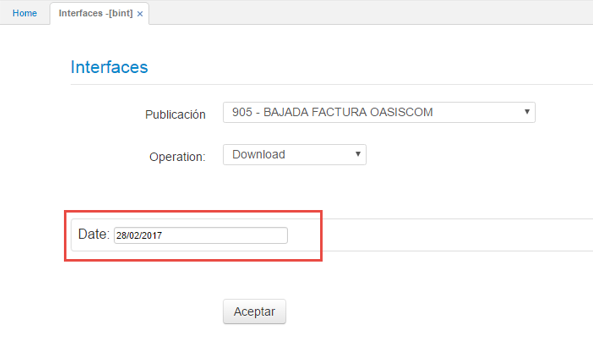
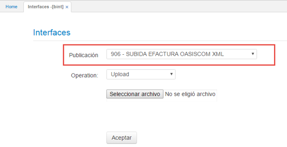
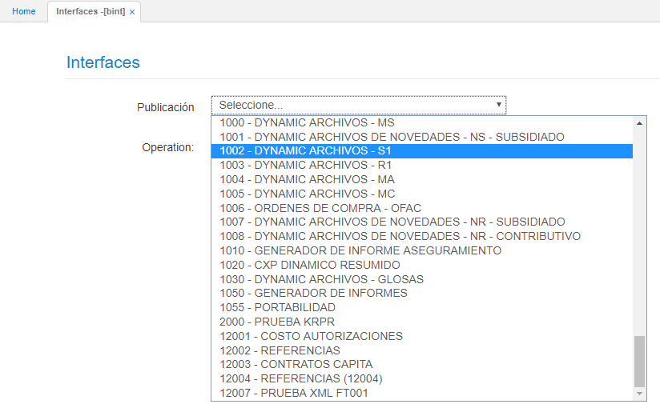
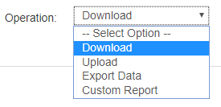
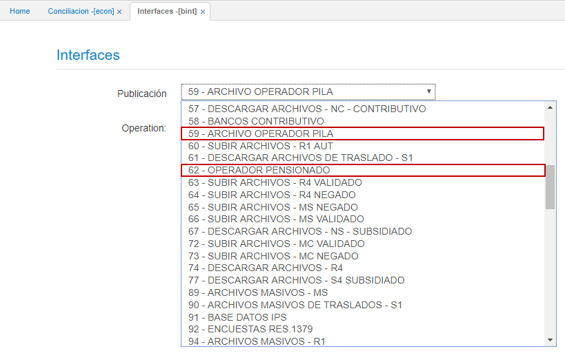
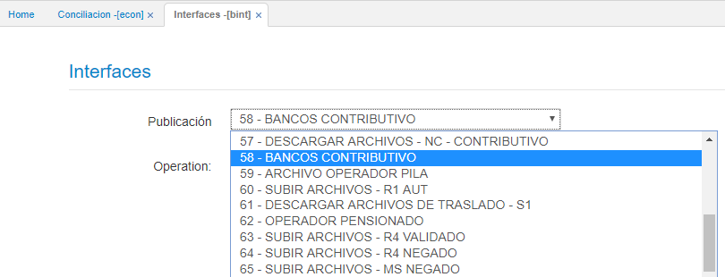

# Interfaces - BINT

Esta aplicación permite cargar o descargar información sobre diferentes escenarios del sistema OasisCom, de acuerdo a una parametrización previa.  

## [Medios Magnéticos](http://docs.oasiscom.com/Operacion/utility/barchi/bint#medios-magnéticos)

En este caso, BINT permite descargar la información necesaria para generar los Médios Magnéticos.

**Publicación:** seleccionar de la lista desplegable el archivo que se desea descargar.  
**Operación:** seleccionar cual es la operación que se desea realizar para el archivo seleccionado, en el caso de medios magnéticos, _Descargar_.  
**Año:** indicar el año correspondiente a la generación del formato seleccionado.  
**Id Formato:** ingresar el número del formato seleccionado anteriormente en el campo publicación.  

Estos dos últimos campos _Año y Id Formato_ es importe que coincidan con la información del formato seleccionado, puesto que, de no ser así el sistema no descargará la información correcta.  

Ingresados los datos dar click en _Aceptar_, el sistema descargará el archivo seleccionado en un formato de Excel al cual se le deberá cambiar la extención del documento de _xlsx_ a _xls_, eliminando la última _x_. La información quedará en el mismo formato que lo exige la DIAN, dicho formato se puede validar en la página web de la entidad.  

Se debe tener en cuenta en el documento de Excel que se vaya a cargar a la DIAN, eliminar la columna en donde se indica el número del formato, puesto que, este número es interno del sistema OasisCom y no es necesario en la información que se vaya a enviar.  

## [Parametrización XML](http://docs.oasiscom.com/Operacion/utility/barchi/bint#parametrización-xml)

En BINT - Interfaces, generaremos el archivo de la publicación parametrizada anteriormente en la aplicación  [**BPUB - Publicaciones**](http://docs.oasiscom.com/Operacion/utility/barchi/bpub). Para ello, seleccionaremos la publicación de la lista desplegable del campo _Publicación_.  

#### **Descarga de archivos**

Al seleccionar la publicación, el sistema automáticamente asignará en el campo _Operación_ la opción **Download** y habilitará el campo _Date_, recordemos que este fue el campo colocado como tipo argumento en el detalle de la aplicación [**BARC - Archivos**](http://docs.oasiscom.com/Operacion/utility/barchi/barc), en este campo ingresaremos la fecha desde la cual se requiere descargar el archivo.  

Realizado lo anterior, damos click en el botón **Aceptar**. El sistema generará un archivo en el navegador Internet Explorer mostrando los registros descargados en formato _.XML_.  

#### **Carga de archivos**

Para subir un archivo se debe seleccionar la publicación previamente parametrizada de la lista del campo **Publicación**. El siguiente campo **Operación** será diligenciado automáticamente con la opción _Upload_.  

Seguidamente, dar click en el botón **Seleccionar archivo** y elegir de allí el que se desea cargar, tener presente que debe estar en formato _.XML_.  

Al seleccionar el archivo se debe dar clic en _Aceptar_ y posteriormente se cargará al sistema.  

Para verificar la información cargada en el sistema por medio de BINT - Interfaces, se puede acceder a las aplicaciones **EFFAC - Facturas** o **EOFAC - Facturas de Compra**.

## [Archivos planos de Salud](http://docs.oasiscom.com/Operacion/utility/barchi/bint#archivos-planos-de-salud)

En la aplicación BINT se crearon los _Dynamic_ para archivos planos (Movimientos), que permiten realizar algunos ajustes previamente con los registros antes de descargar los archivos oficiales.  

Al ingresar a la aplicación se debe seleccionar el archivo según su movimiento en el área de aseguramiento.  

Seguidamente, seleccionamos la operación que se desea hacer con el _Dynamic_.  

En la parte inferior, damos click en el botón , el cual nos arrojará una vista previa de la plantilla con la información contenida en la publicación seleccionada anteriormente.  

Seleccionamos de la lista desplegale _Export Format_, el formato en el cual se desea descargar y finalmente damos click en el botón _Aceptar_.  

A continuación se puede observar que el archivo ha sido descargado en el formato seleccionado.  

El documento se visualizará de la siguiente manera y estará listo para editar en caso que se requiera.  

# [Archivos Conciliación Salud](http://docs.oasiscom.com/Operacion/utility/barchi/bint#archivos-conciliación-salud)

Los archivos planos utilizados para realizar la conciliación de salud deben ser cargados por la aplicación **BINT - Interfaces**. Para cargar los archivos del operador se utilizarán la interfaz **59 - Archivo Operador Pila** correspondiente a los usuarios activos y la interfaz **62 - Operador Pensionado** correspondiente a los usuarios pensionados.

Para cargar el archivo plano enviado por el banco se hará uso de la interfaz **58 - Bancos Contributivos**.

Seleccionada la interfaz correspondiente, indicamos la operación _Upload_ y buscamos el archivo plano ya sea del operador o del banco en el equipo local dando click en el botón **_Seleccionar archivo_**, finalmente damos click en el Botón .

La información cargada se podrá ver reflejada en la aplicación [**ELIQ- Liquidaciones**](http://docs.oasiscom.com/Operacion/is/salud/eafiliacion/movafi/eliq), en donde se creará un documento _PO - Planilla Operador_ para cada uno de los archivos, igualmente, se crearán los documentos _ER - Conciliación Salud_ en la aplicación [**ECON - Conciliación**](http://docs.oasiscom.com/Operacion/is/salud/eafiliacion/movafi/econ), en donde se podrá realizar la conciliación de los aportes que se realizarán.  

# [Parámetros en Mensajes de Error](http://docs.oasiscom.com/Operacion/utility/barchi/bint#parámetros-en-mensajes-de-error)

La aplicación _BINT_ tiene la funcionalidad de arrojar en los mensajes de error los parámetros que se deben configurar correctamente para poder ejecutar una publicación.  

Por ejemplo, seleccionaremos la publicación **3. Bancos** y la operación **Download** y damos click en _Aceptar_.  

Al dar click en _Aceptar_ nos arrojará el siguiente error.  

  
  Configurando los parámetros contenidos en el mensaje de error, se podrá ejecutar correctamente la publicación seleccionada.  

