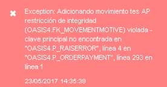

# Adición de Movimiento

## Órdenes de Pago (PORD): Adicionando Movimiento, restricción de integridad

Esta incidencia se presenta porque el concepto que muestra el mensaje de control (para el ejemplo AP) no aparece creado en el básico de conceptos [**BCON - Conceptos**](http://docs.oasiscom.com/Operacion/common/bsistema/bcon), es por esto que el sistema no puede insertar el comprobante de egreso en los movimientos de tesorería [**TMOV - Movimientos de Tesorería**](http://docs.oasiscom.com/Operacion/erp/tesoreria/tmovimient/tmov), para poder corregir está incidencia se debe realizar la parametrización del nuevo concepto y crear el(los) motivo(s) correspondiente(s), posteriormente se puede seguir con el proceso para ejecutar la orden de pago.  

#### [**BCON - Conceptos**](http://docs.oasiscom.com/Operacion/common/bsistema/bcon)

Se debe insertar un nuevo registro con el nuevo concepto. Si no conoces la aplicación de conceptos, puedes validar la documentación  [**BCON - Conceptos**](http://docs.oasiscom.com/Operacion/common/bsistema/bcon), se debe parametrizar los campos requeridos como se muestra en el siguiente ejemplo y en el detalle se debe adicionar el(los) motivo(s).  

Posteriormente si deseas validar la correcta creación del nuevo concepto, puedes consultar la aplicación de básico de documentos [**BDOC - Documentos**](http://docs.oasiscom.com/Operacion/common/bsistema/bdoc), en el maestro filtrar el código del comprobante de egreso (**CE**) y en el detalle en el campo concepto filtrar el concepto que se ha creado, como se muestra en la siguiente imagen.  

